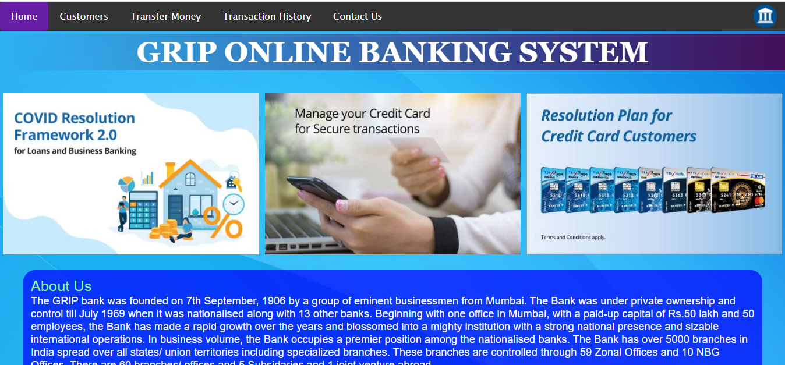
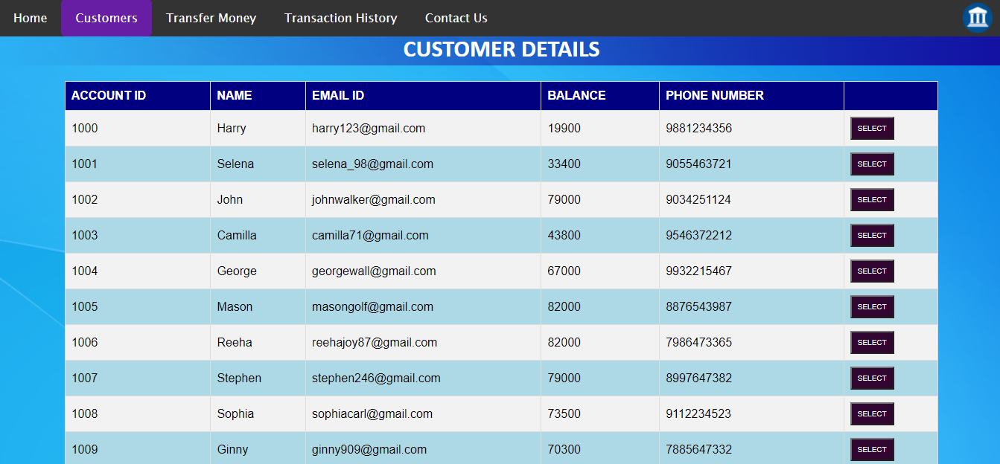
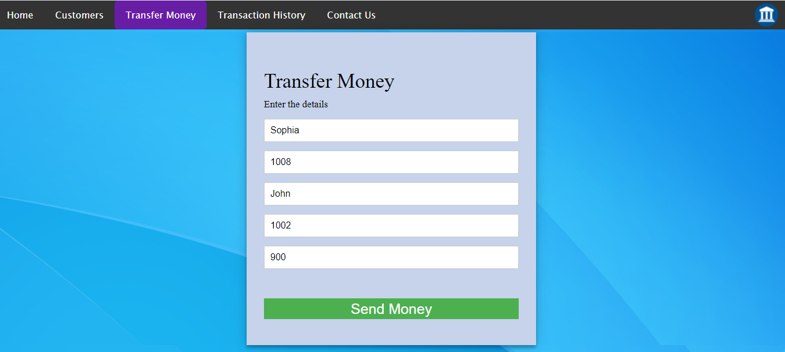
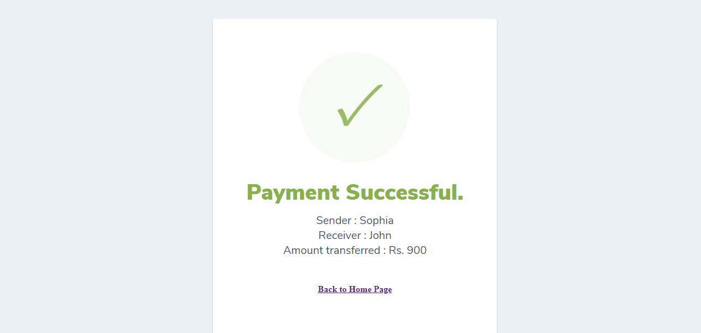
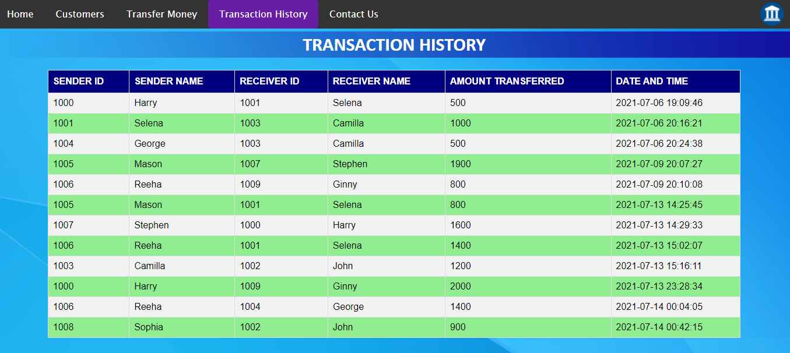
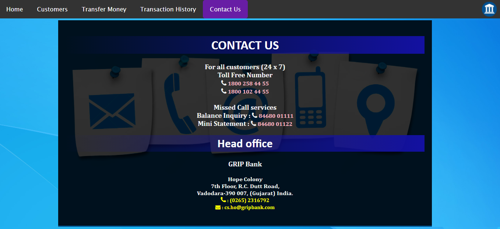

# banksystem-grip
### A basic banking system to transfer money between customers and update the changes in the database tables.

Front-end: HTML, CSS, JavaScript

Back-end: PHP

Database: MySQL

### Home Page

### Customer Details Page

### Transfer Money Page

###  After transaction

### Transaction History Page

### Contact Us Page

